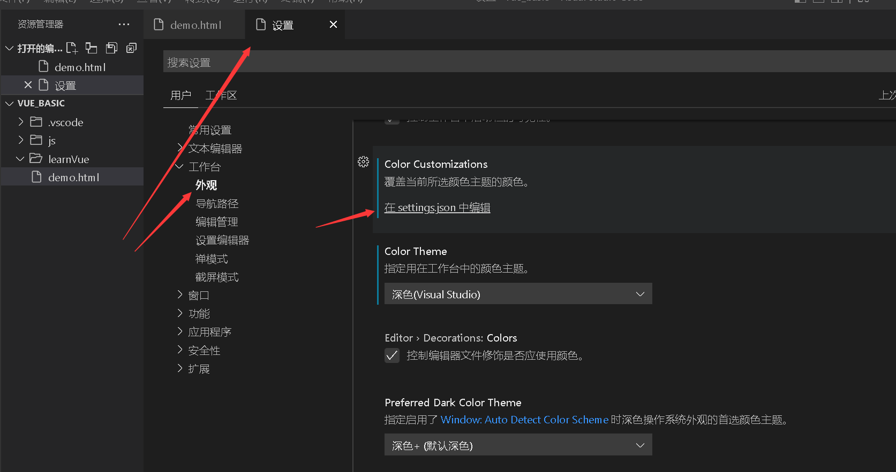

- [[vue]]
	- https://www.bilibili.com/video/BV1Zy4y1K7SH?p=3&t=64.6
- [[vscode]]
	- 设置html自动补全：[VSCode中tab自动补全html代码设置 - 范仁义 - 博客园 (cnblogs.com)](https://www.cnblogs.com/Renyi-Fan/p/13163544.html)
		- 需要在首选项配置中将emmet.triggerExpansionOnTab设置为true值!
		-  EZ)ZF)24_1657959132930_0.png)
- [[外刊]]
	- https://www.bilibili.com/video/BV1tL4y1w746?p=8&t=2.2
	- https://www.bilibili.com/video/BV1tL4y1w746?p=8&t=321.9